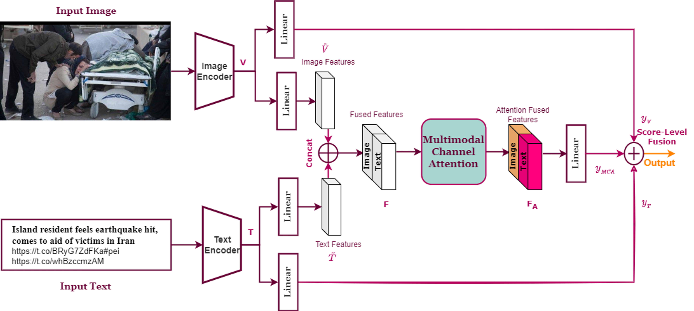

# Categorizing-Crises-from-Social-Media-Feeds-Via-Multimodal-Channel-Attention
[Categorizing-Crises-from-Social-Media-Feeds-Via-Multimodal-Channel-Attention](https://ieeexplore.ieee.org/document/10179859)


## Datasets
- CrisisMMD dataset version v2.0 with agreed labels annotation [CrisisMMD Dataset Link](https://crisisnlp.qcri.org/crisismmd)
- Damage Multimodal Dataset (DMD) [DMD Dataset Link](https://archive.ics.uci.edu/dataset/456/multimodal+damage+identification+for+humanitarian+computing). <br>
  Also,We created  Datasplits for 4-fold cross validation, following crisisMMD datasplits structure and shared in this [link](https://drive.google.com/file/d/17pVoi26BmXlxiUT5ru-jiECXi5A_Poxk/view?usp=sharing)
- The datasets should be listed in datasets directory and organized as follows:

```bash
./datasets
├── CrisisMMD_v2.0
│   ├── annotations
│   ├── crisismmd_datasplit_agreed_label
│   ├── crisismmd_datasplit_all
│   └── data_image
└── DMD_BERUIT
    ├── DMD_Datasplits
    └── multimodal
```

## Requirements

## Usage

## Acknowledgements
+ [Multimodal-Categorization-of-Crisis-Events-in-Social-Media](https://github.com/PaulCCCCCCH/Multimodal-Categorization-of-Crisis-Events-in-Social-Media)
+ [senet.pytorch](https://github.com/moskomule/senet.pytorch)
+ [focal_loss_pytorch](https://github.com/clcarwin/focal_loss_pytorch)

## Citation
If you find this project helpful for your research, please consider citing the following BibTeX entry.
```bibtex
@ARTICLE{10179859,
  author={Rezk, Mariham and Elmadany, Noureldin and Hamad, Radwa K. and Badran, Ehab F.},
  journal={IEEE Access}, 
  title={Categorizing Crises From Social Media Feeds via Multimodal Channel Attention}, 
  year={2023},
  volume={11},
  pages={72037-72049},
  keywords={Visualization;Social networking (online);Feature extraction;Task analysis;Bit error rate;Deep learning;Disaster management;Crisis management;Multimodal deep learning;social media;natural disasters;crisis response;attention;fusion},
  doi={10.1109/ACCESS.2023.3294474}}
```
