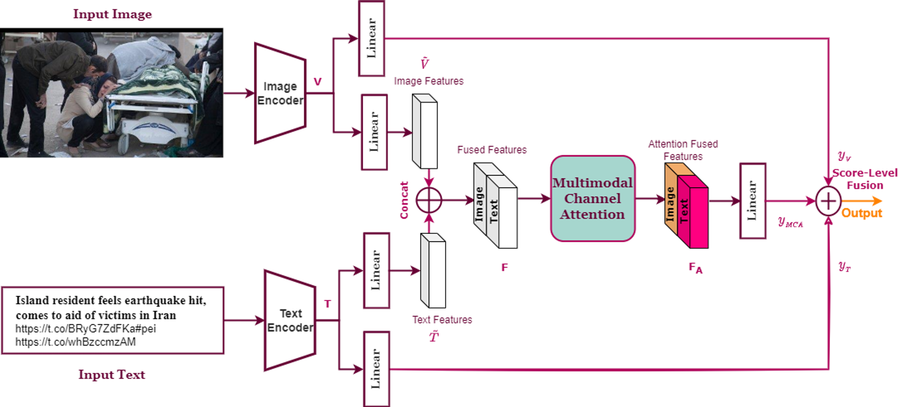

# Categorizing-Crises-from-Social-Media-Feeds-Via-Multimodal-Channel-Attention
[Categorizing-Crises-from-Social-Media-Feeds-Via-Multimodal-Channel-Attention](https://ieeexplore.ieee.org/document/10179859)


## Datasets
- CrisisMMD dataset version v2.0 with agreed labels annotation [CrisisMMD Dataset Link](https://crisisnlp.qcri.org/crisismmd)
- Damage Multimodal Dataset (DMD) [DMD Dataset Link](https://archive.ics.uci.edu/dataset/456/multimodal+damage+identification+for+humanitarian+computing). <br>
  Also,We created  Datasplits for 4-fold cross validation, following crisisMMD datasplits structure and shared in this [link](https://drive.google.com/file/d/17pVoi26BmXlxiUT5ru-jiECXi5A_Poxk/view?usp=sharing)
- The datasets should be listed in datasets directory and organized as follows:

```bash
./datasets
├── CrisisMMD_v2.0
│   ├── annotations
│   ├── crisismmd_datasplit_agreed_label
│   ├── crisismmd_datasplit_all
│   └── data_image
└── DMD_BERUIT
    ├── DMD_Datasplits
    └── multimodal
```

## Requirements
python==3.9.12 , torch>=1.11.0 , torchvision==0.15.2 and transformers==4.11.3

## Usage
```
python3 main.py  [options]

  Arguments:
  --task {'task1', 'task2', 'task2_merged','task3','DMD'}
                        choosing which task from CrisisMMD 3 tasks and DMD only task.
  --mode {'both', 'image_only', 'text_only'}
                         unimodal or multimodal models.
  --model_name MODEL_NAME         
                        Name of Model Directory to be saved in.
  --batch_size BATCH_SIZE
                        (default: 64)
  --learning_rate LEARNING_RATE
                        (default: 2e-4)
  --max_iter MAX_ITER
                        Number of training epochs. (default: 300)

  Testing Arguments:
  --eval                for skipping training and only predict on val test sets.
  --pred_file PRED_FILE
                        for Saving final logits and predictions of models in csv and mat files.
  --model_to_load FUSED_MODEL_TO_LOAD
                        for loading weights of pretrained fused model in test phase if mode=='both'.
  --image_model_to_load IMAGE_MODEL_TO_LOAD
                        for loading weights of pretrained visual model in test phase if mode=='image_only'.
  --text_model_to_load TEXT_MODEL_TO_LOAD
                        for loading weights of pretrained textual model in test phase if mode=='text_only'.
```
 + You can check the rest of arguments in this file [args.py](args.py)
### Example:
```
#training
python3 main.py --task task1 --mode both --batch_size 16 --model_name 'task1/featurefusion/MCA' --max_iter 50

#testing
python3 main.py --task task1 --mode both --batch_size 16 --model_name 'task1/featurefusion/MCA' --eval --model_to_load './output/task1/featurefusion/MCA/best.pt' --pred_file 'predictionVsGroundtruth'
```

## Acknowledgements
+ [Multimodal-Categorization-of-Crisis-Events-in-Social-Media](https://github.com/PaulCCCCCCH/Multimodal-Categorization-of-Crisis-Events-in-Social-Media)
+ [senet.pytorch](https://github.com/moskomule/senet.pytorch)
+ [focal_loss_pytorch](https://github.com/clcarwin/focal_loss_pytorch)

## Citation
If you find this project helpful for your research, please consider citing the following BibTeX entry.
```bibtex
@ARTICLE{10179859,
  author={Rezk, Mariham and Elmadany, Noureldin and Hamad, Radwa K. and Badran, Ehab F.},
  journal={IEEE Access}, 
  title={Categorizing Crises From Social Media Feeds via Multimodal Channel Attention}, 
  year={2023},
  volume={11},
  pages={72037-72049},
  keywords={Visualization;Social networking (online);Feature extraction;Task analysis;Bit error rate;Deep learning;Disaster management;Crisis management;Multimodal deep learning;social media;natural disasters;crisis response;attention;fusion},
  doi={10.1109/ACCESS.2023.3294474}}
```
